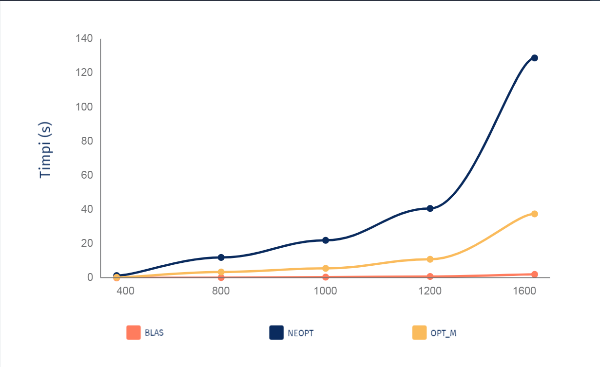

# Matrix-Multiplication-Optimisation-Analysis 

##### Calcan Elena-Claudia
##### 331CA

### Introducere
-----------------------------

Este implementata in 3 moduri urmatoarea operatie cu matrici:

            C = B * A * At + Bt * B, unde

            At si Bt sunt trasnpusele matricilor A si B.

Pentru o usurinta a calculelor, s-a impartit operatia astfel:

            X = A * At
            C = Bt * B
            C += B * X

Modurile in care este implementata operatia este:
- blas
- neopt
- opt_m

#### BLAS
----------------------------
- implementarea consta in folosirea functiilor din biblioteca *blas*
- s-au folosit functiile *dtrmm* si *dgemm*
- s-a folosit *dtrmm* in calculul *A * At*, pentru a tine cont de faptul ca
  matricea A este o matrice superior triunghiulara
- pentru celelalte operatii s-a folosit *dgemm*

        Timpii obtinuti pe cele 3 teste:
            • Run=./tema2_blas: N=400: Time=0.038366
            • Run=./tema2_blas: N=800: Time=0.280015
            • Run=./tema2_blas: N=1200: Time=0.920132

#### NEOPT
-----------------------------

- metoda consta in implementarea algoritmului naiv de inmultire a matricilor,
  fara sa se faca vreo optimizare
- la inceput s-au calculat transpusele matricilor A si B
- inmultirile matricilor s-au relizat separat, pe rand
- rezultatul inmultirii *Bt * B* s-a stocat in C
- in X se salveaza rezulatul operatiei *A * At*
- rezultatul final se salveaza in C, adunand valorile din C cu rezultatele
  inmultirii *B * X*
- loop-urile folosite au configuratia i-j-k
- matricea A fiind o matrice superior triunghiulara, s-a parcurs doar
  elementele care sunt deasupra diagonalei principale

        Timpii obtinuti pe cele 3 teste:
           • Run=./tema2_neopt: N=400: Time=1.451178
           • Run=./tema2_neopt: N=800: Time=12.529191
           • Run=./tema2_neopt: N=1200: Time=41.616508

#### OPT_M
-----------------------------

- metoda reprezinata implemtarea optima a algoritmului de inmultire de
  matrici
- ordinea operatiilor sunt la fel ca in metoda *neopt*
- optimizarile aduse algoritmului sunt urmatoarele:

  - folosirea registrelor procesorului
  - folosirea unei variabile in cadrul buclelor pentru a reduce numarul de
    acces la memorie
  - folosirea pointerilor, in loc sa se calculeze indecsii, astfel scazandu-se
    numarul total de operatii facute de procesor
  - la inmultirea matricelor normale, configuratia loop-urilor este i-k-j care
    ar trebui sa aiba performante cele mai bune performante

        Timpii obtinuti pe cele 3 teste:
          Run=./tema2_opt_m: N=400: Time=0.399113
          Run=./tema2_opt_m: N=800: Time=3.346912
          Run=./tema2_opt_m: N=1200: Time=11.724156

### Analiza Grafic
-----------------------------

- din grafic se observa ca cea mai buna metoda este *blas*, folosind functii
  care sunt specifice operatiilor pe matrici
- cum metodele *neopt* si *opt_m* au aceeasi complexitate O(n2),
  se observa cum optimizarile facute in *opt_m* au facut o diferenta foarte mare a performantei intre cele doua metode
- totusi, se poate vedea cum metodele *neopt* si *opt_m* cresc exponential,
  metoda *blas* este reprezentata pe grafic doar de o singura dreapta

### Analiza  Cachegrind

  - informatiile despre cache a metodelor sunt salvate in fisierele .cache
    corespunzatoare, incluse in arhiva

      #### 1. I refs
      - afiseaza informatii despre numarul de instructiuni asupra cache-ului
      - pentru metoda *blas* se observa un numar foarte mic de instructiuni si
        un procent nesemnificativ a *miss rate-ului*
      - metodele *neopt* si *opt_m* au un numar foarte de instructiuni, dar intre ele
        este o diferenta considerabila facuta de folosirea pointerilor in varianta
        *opt_m*
      - totusi acesete doua metode au *miss rate-ul* egal cu 0.00%

      #### 2. D refs
      - afiseaza informatii despre numarul de accesari a datelor din cache
      - la fel ca la *I refs*, metoda *blas* are un numar foarte mic de accesari,
        pe cand celelalte doua metode au un numar foarte mare, dar cu o diferenta
        considerabila intre ele
      - se observa o diferenta a *D1 (fisrst data level) miss rate* intre cele
        trei implementari, cel mica valoare avand metoda *blas*
      - toate metodele au un *miss rate al LLD (last level data cache)* aproximativ
        egal cu 0.00%

      #### 3. LLs refs
      - afiseaza informatii despre pentru instructiunile si datele din Last Level cache
      - metoda *blas* are o diferenta considerabila fata de celalte doua metode la
        last level references
      - totusi metodele au un *miss rate* destul de apropiat

      #### 4. Branches
      - afiseaza informatii leagte de branch prediction
      - metoda *blas* are o diferenta considerabila a nuamrului de branch-uri si a
        missprediction fata de celelalte doua metode, care acestea au aproape aceleasi
        valori

### Concluzii
----------------------------
- din analiza facuta mai sus cea mai buna implementare este cea facuta cu functiile
  specifice operatiilor cu matrici din biblioteca blas, aceast fiind cel mai eficient
  din punct de vedere a timpului de rulare, cat si a folosirea cache-ului
- totusi putem observa cu optimizarile facute asupra algoritmului clasic de inmultire
  a matricelor au avut un impact semificitaiv asupra timpului de rulare cat si a opeartiilor
  asupra cache-ului

### Referinte
----------------------------
- https://ocw.cs.pub.ro/courses/asc/laboratoare/05
- http://www.netlib.org/blas/
- https://www.geeksforgeeks.org/program-to-find-transpose-of-a-matrix/
- https://stackoverflow.com/questions/20172216/how-do-you-interpret-cachegrind-output-for-caching-misses
- https://www.cs.cmu.edu/afs/cs.cmu.edu/project/cmt-40/Nice/RuleRefinement/bin/valgrind-3.2.0/docs/html/cg-manual.html
